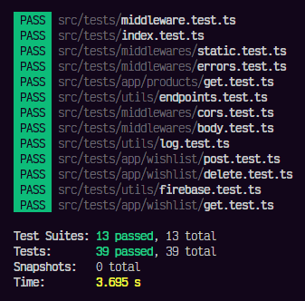

# poc-vue

Prova de conceito usando NodeJS

## Desenvolvimento

1 - Instale: `npm i`

2 - Rode: `npm run dev`

3 - Acesse: http://localhost:3000

## Deploy

1 - Compile: `npm run build`

2 - Rode: `npm run start`

3 - Acesse: http://localhost:3000

4 - Suba: `railway up` (Necessário estar logado em uma conta Railway)

## Teste unitário

- Execute: `npm run test`
